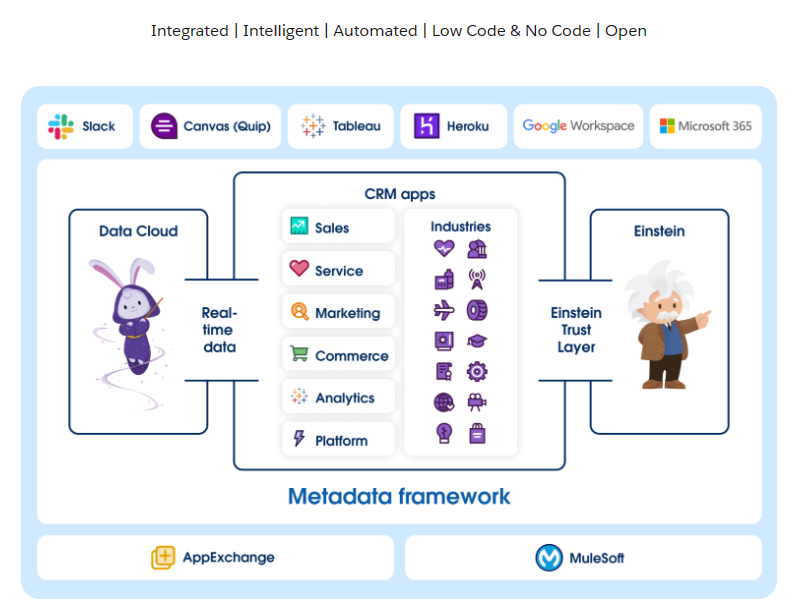

# Case Study: AI in Business - Salesforce Einstein 1 Platform

## Overview and Origin

* **Name of company**: Salesforce 
* **Incorporation**: Founded in 1999. Salesforce Einstein 1 Platform was introduced in 2016 as a part of Salesforce's suite of CRM (Customer Relationship Management) tools.
* **Founders**: Marc Benioff, Parker Harris, Dave Moellenhoff, Frank Dominguez. 
* **Idea Origins**: Salesforce originated from Marc Benioff's vision to create a cloud-based Customer Relationship Management (CRM) platform that revolutionizes how businesses manage their customer interactions and sales processes. The idea came about as a response to the limitations and complexities of traditional CRM software.
The idea for Salesforce Einstein 1 emerged from the need to enhance Salesforce's CRM platform with AI capabilities to enable businesses to leverage predictive analytics, natural language processing (NLP), and machine learning to drive sales, marketing, and customer service initiatives.
* **Funding**: Salesforce is a publicly traded company (NYSE: CRM) and generates revenue through subscription-based services. The development of Salesforce Einstein 1 is financed through Salesforce's overall revenue streams.

## Business Activities

Salesforce Einstein aims to address the challenges businesses face in leveraging data effectively to enhance customer engagement, sales forecasting, and marketing campaign optimization. Traditional CRM systems often lack the intelligence to provide actionable insights from vast amounts of customer data.
Salesforce Einstein 1 Platform intends to
    - Drive productivity and personalization with predictive and generative AI across the Customer 360. 
    - Create and deploy assistive AI experiences natively in Salesforce, allowing customers and employees to converse directly with Einstein to solve issues faster and work smarter. 
    - Empower sellers, agents, marketers, and more with AI tools safely grounded in customer data to make every customer experience more impactful.

Salesforce Einstein caters to businesses of all sizes and industries, ranging from small startups to large enterprises. Their target customers include sales teams, marketing departments, customer service representatives, and executives looking to streamline their operations and improve customer satisfaction.

Salesforce Einstein offers AI-powered features embedded within Salesforce's CRM platform, including predictive lead scoring, personalized email marketing, chatbots for customer service, and AI-driven analytics. Its seamless integration with existing Salesforce workflows and datasets provides businesses with actionable insights and recommendations to drive revenue growth and operational efficiency.

* **Technologies**: Salesforce Einstein leverages a combination of machine learning algorithms, natural language processing (NLP), and predictive analytics to analyze customer data, identify patterns, and make data-driven recommendations. It harnesses the power of Salesforce's vast data ecosystem to train and refine its AI models continuously.

## Landscape

* **Field**: Salesforce Einstein operates in the broader field of CRM (Customer Relationship Management) software, augmented with AI capabilities.

* **Trends and Innovations**: Over the past decade, there has been a significant shift towards AI-driven automation and personalization in business software solutions. Companies are increasingly adopting AI-powered tools to gain actionable insights from their data, automate repetitive tasks, and deliver personalized customer experiences. The integration of AI into CRM platforms represents a major trend in business technology, enabling companies to unlock the full potential of their customer data.

* **Major Competitors**: Salesforce Einstein faces competition from other CRM providers offering AI-driven solutions.
Some of the providers include 
    Microsoft Dynamics 365 AI
    SAP Sales Cloud
    Oracle CX Cloud
    HubSpot CRM
Each competitor offers its own set of AI-powered features and integrations tailored to specific business needs and industries.

## Results

* **Business Impact**: Salesforce Einstein has had a significant impact on Salesforce's overall business, contributing to its position as a market leader in CRM software. The integration of AI capabilities has helped Salesforce attract new customers, retain existing ones, and increase its average revenue per user (ARPU) by offering additional value-added services.
* **Core Metrics**: Key metrics for Salesforce Einstein include user adoption, customer satisfaction, and ROI (Return on Investment) for AI-powered features. Salesforce tracks metrics such as lead conversion rates, customer retention rates, and sales pipeline velocity to measure the effectiveness of Salesforce Einstein in driving business outcomes for its customers.
* **Competitive Performance**: Salesforce Einstein has established itself as a leading AI-powered CRM platform, outperforming many of its competitors in terms of market share, customer satisfaction, and product innovation. Salesforce continues to invest in R&D to enhance Einstein's capabilities and maintain its competitive edge in the rapidly evolving AI landscape.

## Recommendations

* **Enhanced Personalization**: Salesforce Einstein should continue to focus on enhancing its personalization capabilities by integrating advanced AI techniques such as reinforcement learning and deep learning to deliver hyper-personalized customer experiences across all touchpoints.
* **Vertical-Specific Solutions**: Salesforce should develop industry-specific AI solutions tailored to the unique needs and challenges of different verticals, such as healthcare, finance, retail, and manufacturing, to unlock new revenue opportunities and address niche market segments.
* **Ethical AI Practices**: Salesforce should prioritize ethical considerations in the development and deployment of AI algorithms, ensuring transparency, fairness, and accountability in their decision-making processes to build trust with customers and regulators.

## References

1. Salesforce Einstein Official Website - [https://www.salesforce.com/products/einstein/overview/](https://www.salesforce.com/products/einstein/overview/)
2. "The Impact of AI on CRM" - Forbes. [https://www.forbes.com/sites/forbestechcouncil/2020/12/09/the-impact-of-ai-on-crm/?sh=4e27f8815a51](https://www.forbes.com/sites/forbestechcouncil/2020/12/09/the-impact-of-ai-on-crm/?sh=4e27f8815a51)
